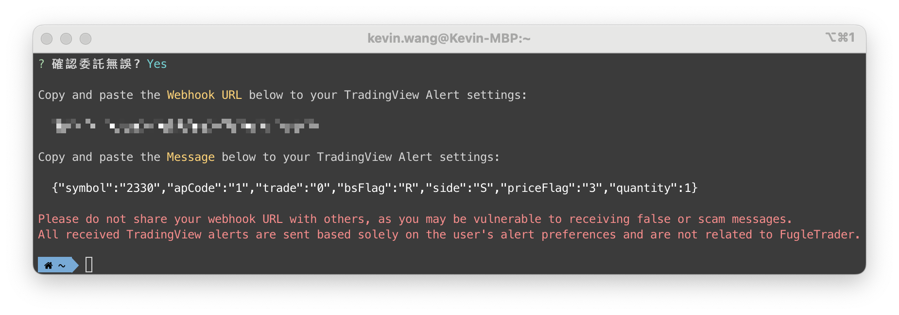
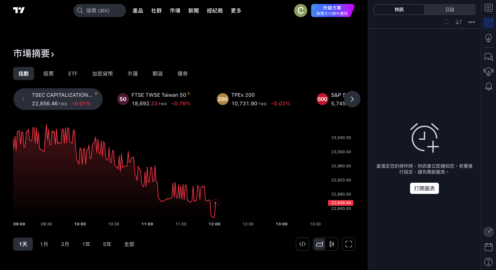

[TradingView](https://tw.tradingview.com) 是一個強大的線上金融市場分析平台，提供多樣化的圖表工具、技術分析指標、交易信號及社群互動功能。透過其 **快訊 (Alerts)** 與 **Webhooks** 功能，使用者可以設立警示或執行交易策略。當這些警示或策略被觸發時，TradingView 會向 FugleTrader API 發送一則包含股票代號、交易方向、價格、數量等資訊的 Webhook 訊息，讓 FugleTrader 自動執行交易。

<!--truncate-->

## 什麼是 TradingView Webhook？

Webhook 是一種即時數據傳輸的方式，能讓 TradingView 將特定條件直接傳遞到 FugleTrade，觸發相應的交易訂單。透過 Webhook，TradingView 用戶可以設定快訊或執行交易策略。當這些條件被滿足時，TradingView 將發送一則包含股票代號、交易方向、價格、數量等資訊的 Webhook 訊息給 FugleTrader，從而實現自動交易。

## 使用 TradingView Webhook 的先決條件

在開始使用 Webhook 功能之前，您需要確保滿足以下條件：

- 您必須擁有 TradingView **Essential**、**Plus**、**Premium**、**Expert** 或 **Ultimate** 帳戶，因為只有這些帳戶等級支援 Webhook 功能。
- TradingView 提供的臺灣股市行情數據中，**證券櫃檯買賣中心** 掛牌的股票（上櫃、興櫃）為即時行情，而 **臺灣證券交易所** 掛牌的股票（上市）則有 15 分鐘的延遲。如果您希望取得上市股票的最新報價，則需要額外訂閱臺灣證券交易所的行情數據。

## 如何在 FugleTrader 設定 Webhook 訊號交易

### 在 FugleTrader 建立 Webhook

首先，請確保您已經完成 FugleTrader 的安裝步驟。接著，輸入以下指令以建立 Webhook：

```bash
fugletrader webhook
```

程式會以問答形式引導您決定下單內容：


完成後，請再次確認委託內容無誤：



### 在 TradingView 設定 Webhook

接下來，我們將示範如何在 [TradingView](https://tw.tradingview.com) 上設置快訊及 Webhooks。登入 TradingView 網站後，您可以在畫面右側找到快訊選單。



為了設定快訊，您需要進入圖表。以 **台積電**（2330）為例，設定觸發條件、選項、到期時間和快訊動作。請在快訊通知中勾選「Webhook URL」，並填入您剛剛在 FugleTrader 建立的 Webhook URL。


選擇 Webhook URL 後，設定快訊名稱和訊息。確認所有設置正確後，按下「Create」按鈕。


**注意事項：**
- 切勿向他人透露您的 Webhook URL，以免收到虛假或詐騙訊息，或他人冒充您下達虛假訂單。
- 所有由 TradingView 提供的提醒均基於用戶設置，FugleTrade 不承擔任何因此產生的交易虧損責任。
- 訊號觸發依賴於第三方平台，可能存在訊號丟失或延遲的風險。
- 每個交易對必須單獨建立 Webhook。

## 啟用 ngrok 測試 Webhook URL

[ngrok](https://ngrok.com/) 是一個跨平台的應用程式，可以將本地端伺服器公開到 Internet，而讓外部網路存取內部網路伺服器。由於 Webhook 提供者在發生某些事件時會發送 POST 請求，因此 Webhook URL 必須是可以在網際網路上公開訪問的。當我們在本地伺服器測試 Webhook 時，ngrok 是一個十分便利的工具，可以快速將 `localhost` 透過 ngrok 作為反向代理來讓外部訪問。

FugleTrader 內建對 [ngrok](https://ngrok.com) 的支援，透過 ngrok，您可以輕鬆測試 TradingView Webhook。詳細設定方式請參閱 [使用教學](/docs/intro)。

## 結語

透過 TradingView 的 Webhook 功能與 FugleTrader 的無縫整合，您將能夠快速、高效地執行交易，享受更靈活的投資體驗。現在就開始您的自動交易之旅吧！
