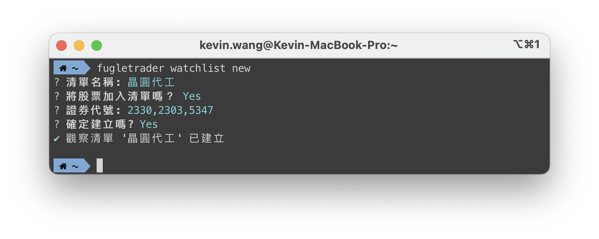
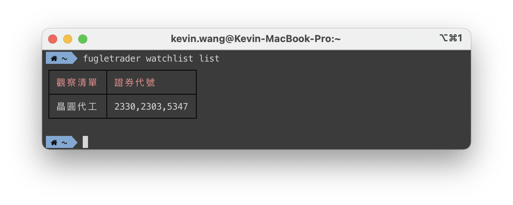
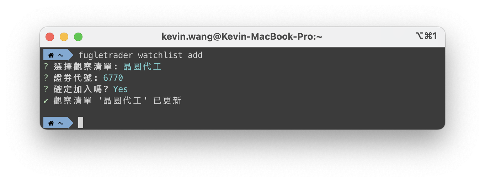
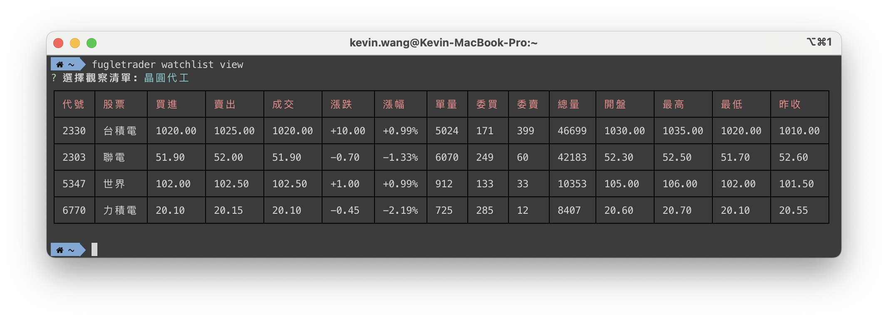
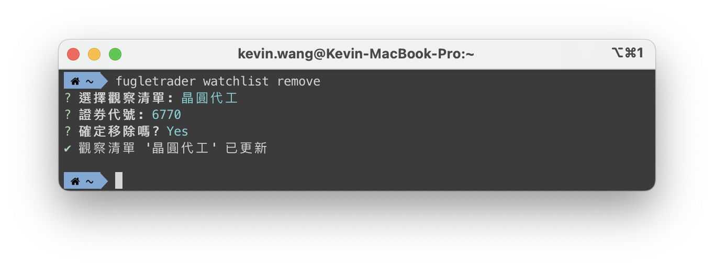
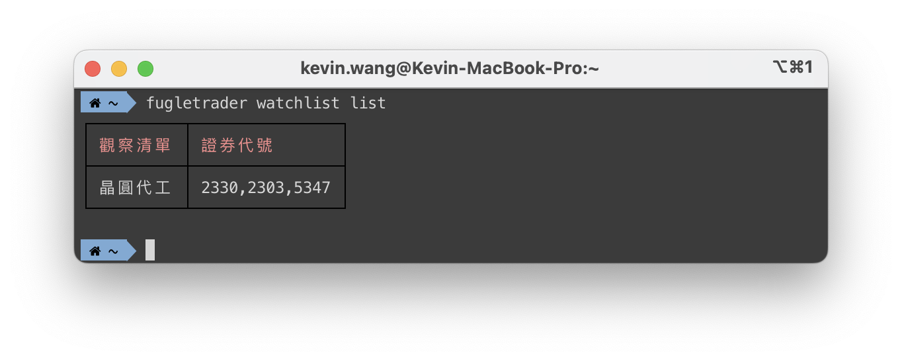
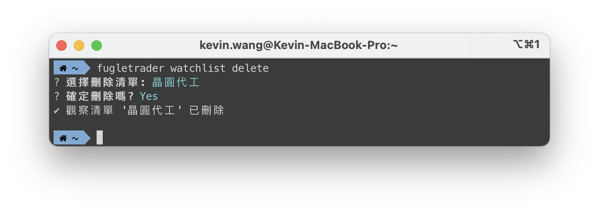
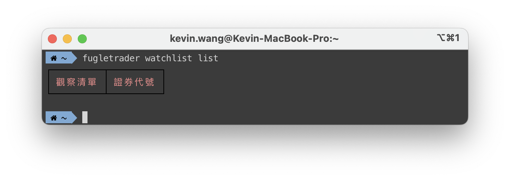

在股票交易的過程中，管理自選股清單可以幫助投資者快速跟踪關注的股票。FugleTrader 的 `watchlist` 指令讓您輕鬆建立和管理自選股清單，即時監控市場變動。本文將介紹該指令的基本用法與功能，幫助您有效管理自選股。

<!--truncate-->

## 指令簡介

`fugletrader watchlist` 指令提供了管理自選股清單的功能，包括查看清單、建立新的清單、加入或移除股票，以及刪除整個清單。無論您是新手投資者還是有經驗的交易者，都可以透過這些簡單的指令來方便地管理您的自選股。

### 基本用法

```bash
Usage: fugletrader watchlist|w [options] [command]
```

這是 `watchlist` 指令的基本用法，`fugletrader watchlist` 或其簡寫形式 `fugletrader w` 都可以使用。接下來讓我們看看該指令所支援的選項與子指令。

### Options

- `-h, --help`：顯示該指令的幫助資訊。

這是通用的幫助選項，當您對任何指令不確定時，使用 `--help` 會提供詳細的指令說明。

## Commands 子指令介紹

### 列出所有自選股清單

```bash
fugletrader watchlist list
```

使用 `list` 子指令，您可以快速查看所有已建立的自選股清單。如果您管理多個不同的清單，此指令將是管理它們的第一步。

### 建立新的自選股清單

```bash
fugletrader watchlist new [list-name]
```

若您想建立一個新的自選股清單，可以使用 `new` 指令。`list-name` 是選填項，如果您未指定清單名稱，系統會請您指定一個清單名稱。

範例：



此範例建立了一個名為 `晶圓代工` 的清單，專門用來追蹤晶圓代工概念股。



### 加入股票到自選股清單

```bash
fugletrader watchlist add [list-name]
```

當您有新的股票想加入某個自選股清單時，使用 `add` 指令來完成。只需提供清單名稱及股票代碼，即可將股票加入進去。

範例：



這將把 **力積電（6770）** 股票加入至 `晶圓代工` 清單中。


### 查看特定自選股清單

```bash
fugletrader watchlist view [list-name]
```

使用 `view` 指令，您可以查看特定清單中的所有股票。

範例：



這將顯示 `晶圓代工` 清單中的所有股票。

### 從自選股清單移除股票

```bash
fugletrader watchlist remove [list-name]
```

如果您不再關注某些股票，使用 `remove` 指令可以將它們從清單中移除。

範例：



這將把 **力積電（6770）** 股票從 `晶圓代工` 清單中移除。



### 刪除整個自選股清單

```bash
fugletrader watchlist delete [list-name]
```

如果某個自選股清單已經不再需要，可以使用 `delete` 指令將該清單刪除。

範例：



此指令將刪除 `晶圓代工` 清單及其內容。



## 結語

透過使用 `fugletrader watchlist` 指令，您可以方便地建立、管理和查看您的自選股清單，輕鬆追蹤市場變化。無論是加入新股票還是移除不再關注的標的，這些功能都能幫助您更靈活地管理投資組合。

開始使用這些指令，為您的投資旅程增添便利吧！
