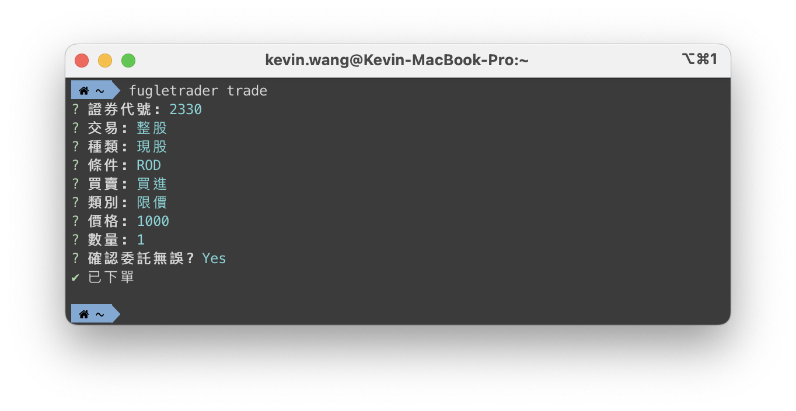
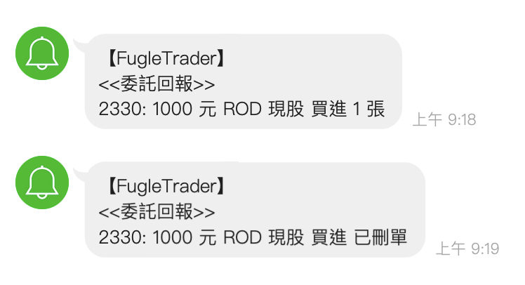

# 下單委託

在本節中，我們將為您示範如何使用 FugleTrader CLI 進行下單委託操作。

## 如何下單

如要進行交易，您只需在命令列中輸入以下指令：

```bash
fugletrader trade
```

程式會提示您輸入委託內容，如下圖所示：



## 委託回報

若您啟用了 LINE Notify 通知，則將收到委託回報的訊息：



如需了解更多 CLI 指令的使用方法，請參閱 [CLI 指令參考](/docs/cli-command-reference)。
