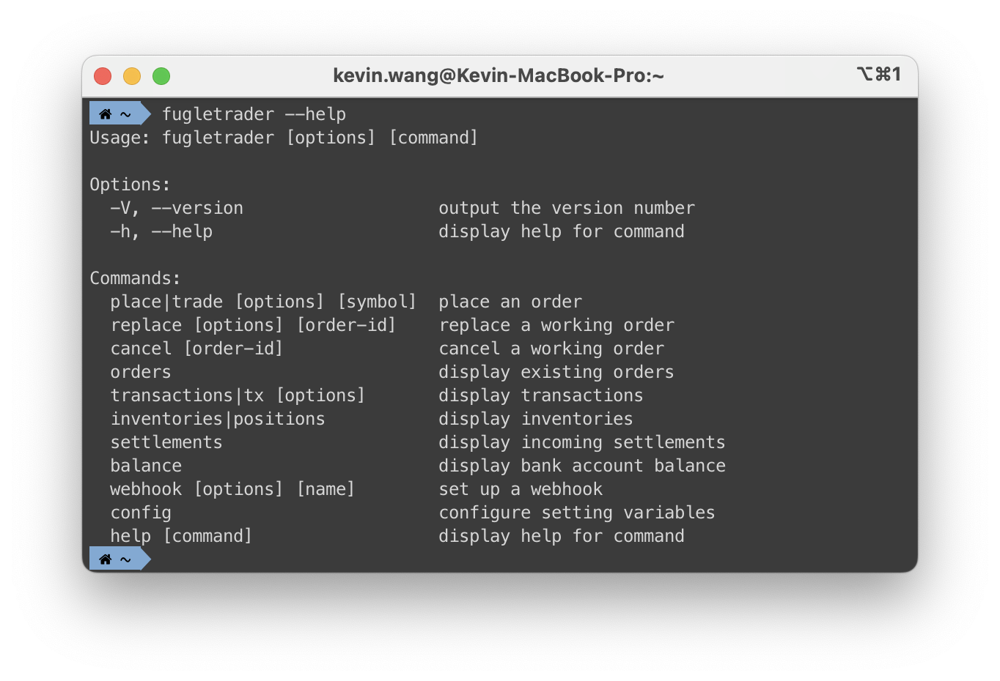

# 快速開始

最快速啟動 FugleTrader 的方式是使用 `docker-compose`：

```yml
version: "3"

services:
  api:
    image: chunkai1312/fugletrader-api:latest
    ports:
      - "3000:3000"
    environment:
      - FUGLE_TRADE_API_URL=${FUGLE_TRADE_API_URL}
      - FUGLE_TRADE_API_KEY=${FUGLE_TRADE_API_KEY}
      - FUGLE_TRADE_API_SECRET=${FUGLE_TRADE_API_SECRET}
      - FUGLE_TRADE_AID=${FUGLE_TRADE_AID}
      - FUGLE_TRADE_PASSWORD=${FUGLE_TRADE_PASSWORD}
      - FUGLE_TRADE_CERT_PATH=${FUGLE_TRADE_CERT_PATH}
      - FUGLE_TRADE_CERT_PASS=${FUGLE_TRADE_CERT_PASS}
      - FUGLE_MARKETDATA_API_KEY=${FUGLE_MARKETDATA_API_KEY}
      - NOTIFIER_SERVICE=${NOTIFIER_SERVICE}
      - LINE_NOTIFY_ACCESS_TOKEN=${LINE_NOTIFY_ACCESS_TOKEN}
      - LINE_CHANNEL_ACCESS_TOKEN=${LINE_CHANNEL_ACCESS_TOKEN}
      - LINE_CHANNEL_SECRET=${LINE_CHANNEL_SECRET}
      - LINE_USER_ID=${LINE_USER_ID}
      - TELEGRAM_BOT_TOKEN=${TELEGRAM_BOT_TOKEN}
      - TELEGRAM_USER_ID=${TELEGRAM_USER_ID}
      - DISCORD_BOT_TOKEN=${DISCORD_BOT_TOKEN}
      - DISCORD_USER_ID=${DISCORD_USER_ID}
      - NGROK_ENABLED=${NGROK_ENABLED}
      - NGROK_AUTHTOKEN=${NGROK_AUTHTOKEN}
    volumes:
      - ./certs:/app/certs
    restart: always

  cli:
    image: chunkai1312/fugletrader-cli:latest
    stdin_open: true
    tty: true
    environment:
      - FUGLETRADER_API_URL=${FUGLETRADER_API_URL}

volumes:
  certs:
```

環境變數說明：

- `FUGLE_TRADE_CERT_PATH`: 您的交易憑證路徑。
- `FUGLE_TRADE_API_URL`: 富果交易 API URL。
- `FUGLE_TRADE_API_KEY`: 您的富果交易 API 金鑰。
- `FUGLE_TRADE_API_SECRET`: 您的富果交易 API 私鑰。
- `FUGLE_TRADE_AID`: 您的證券帳戶 ID。
- `FUGLE_TRADE_PASSWORD`: 您的證券帳戶密碼。
- `FUGLE_TRADE_CERT_PASS`: 您的交易憑證密碼。
- `FUGLE_MARKETDATA_API_KEY`: 您的富果行情 API 金鑰。
- `NOTIFIER_SERVICE`: (可選) 指定啟用的主動回報通知服務，可選 `line-notify`、`line`、`telegram`、`discord`。
- `LINE_NOTIFY_ACCESS_TOKEN`: (可選) 您的 LINE Notify 存取權杖。
- `LINE_CHANNEL_ACCESS_TOKEN`: (可選) 您的 LINE Channel Access Token。
- `LINE_CHANNEL_SECRET`: (可選) 您的 LINE Channel Access Secret。
- `LINE_USER_ID`: (可選) 您的 LINE User ID。
- `TELEGRAM_BOT_TOKEN`:(可選) 您的 Telegram Bot Token。
- `TELEGRAM_USER_ID`: (可選) 您的 Telegram User ID。
- `DISCORD_BOT_TOKEN`: (可選) 您的 Discord Bot Token。
- `DISCORD_USER_ID`: (可選) 您的 Discord User ID。
- `NGROK_ENABLED`: (可選) 是否啟用 ngrok 通道。
- `NGROK_AUTHTOKEN`: (可選) 您的 ngrok Authtoken。
- `FUGLETRADER_API_URL`: CLI 使用的 FugleTrader API URL。

## 啟動 FugleTrader API 伺服器

執行以下指令啟動 FugleTrader API 伺服器：

```bash
docker compose up api
```

## 使用 FugleTrader CLI 客戶端

當 FugleTrader API 伺服器啟動後，您可以使用 CLI 與其互動：

```bash
docker compose run --rm cli --help
```

若您已經透過 `npm` 全域安裝了 CLI，則可以執行：

```bash
fugletrader --help
```

此外，您可以使用以下指令來設定 `FUGLETRADER_API_URL`：

```bash
fugletrader config set FUGLETRADER_API_URL=<YOUR_FUGLETRADER_API_URL>
```



## CLI 指令總覽

執行 `fugletrader <command> --help` 來查看各指令的選項說明。更多詳細內容請參閱 [CLI 指令參考](/docs/cli-command-reference.md)。

| Command        | Alias       | Description  |
| -------------- | ----------- | ------------ |
| `quote`        | `q`         | 顯示最新股價。 |
| `watchlist`    | `w`         | 管理觀察清單。 |
| `place`        | `trade`     | 委託下單。 |
| `replace`      |             | 修改進行中的委託單。 |
| `cancel`       |             | 取消進行中的委託單。 |
| `orders`       |             | 顯示現有的委託單。 |
| `transactions` | `tx`        | 顯示交易紀錄。 |
| `inventories`  | `positions` | 顯示庫存損益。 |
| `settlements`  |             | 顯示交割資訊。 |
| `balance`      |             | 顯示銀行餘額。 |
| `webhook`      |             | 設定 Webhook。 |
| `config`       |             | 配置設定變數。 |
| `help`         |             | 顯示幫助資訊。 |


