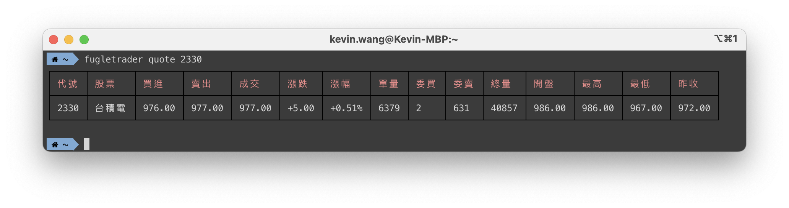
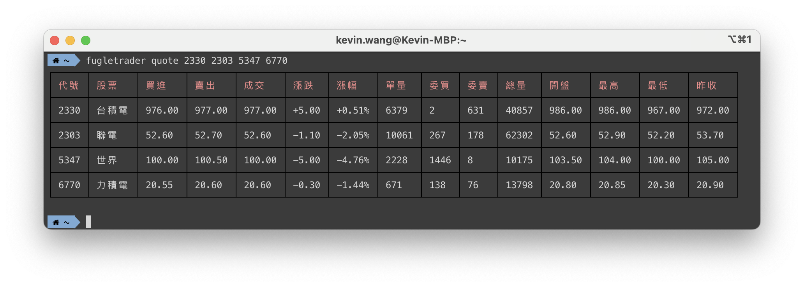
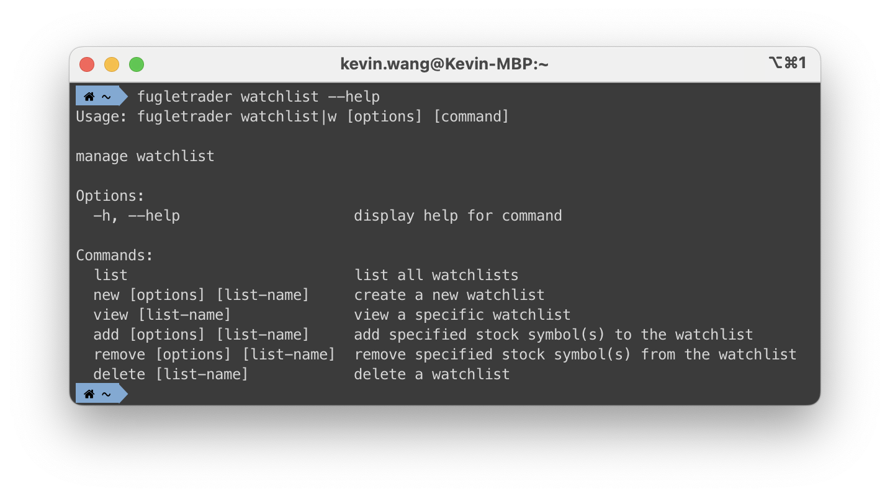

# 股價查詢

在這一節，我們將示範如何使用 FugleTrader CLI 來查詢股票報價。

## 查詢最新股價

若要取得最新的股票報價，請輸入以下指令：

```bash
fugletrader quote 2330
```

執行後的結果如下圖所示：



你也可以一次查詢多檔股票，範例如下：

```bash
fugletrader quote 2330 2303 5347 6770
```

結果如下圖所示：



## 管理觀察清單

FugleTrader 也提供觀察清單功能，讓你可以輕鬆管理多檔股票。若要查看觀察清單的相關指令，請輸入以下指令：

```bash
fugletrader watchlist --help
```

指令說明畫面如下：



如需了解更多 CLI 指令的使用方法，請參閱 [CLI 指令參考](/docs/cli-command-reference)。
