# 設定 Discord Bot (可選)

Discord Bot 是一個自動化工具，能夠在 Discord 伺服器中執行多種任務，如管理頻道、回應指令等，提升用戶的互動體驗。FugleTrader 支援透過 Discord Bot 推送主動回報通知。如果您想啟用此功能，需先完成以下步驟，包括申請 Discord 帳號、建立 Discord 伺服器、設置開發者應用程式，並將 Bot 加入伺服器以及取得使用者 ID。

## 建立 Discord 伺服器

1. 前往 [Discord](https://discord.com) 網站，登入你的 Discord 帳號後，點選「開啟 Discord」。
  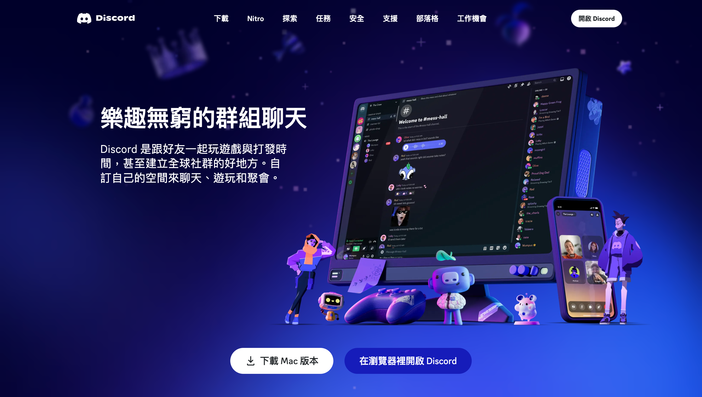

2. 在 Discord 主頁左側選單中，點擊「＋」按鈕以建立新的伺服器。
  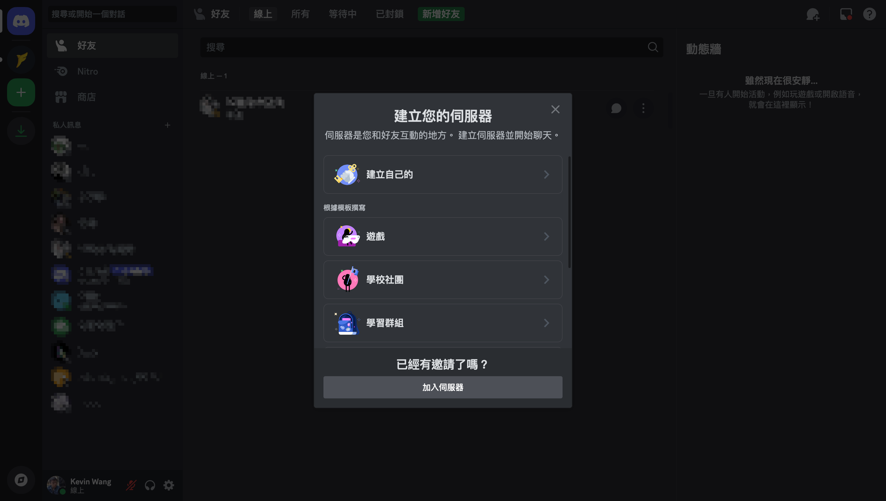

3. 輸入伺服器名稱後，點擊「建立」完成伺服器建立。
  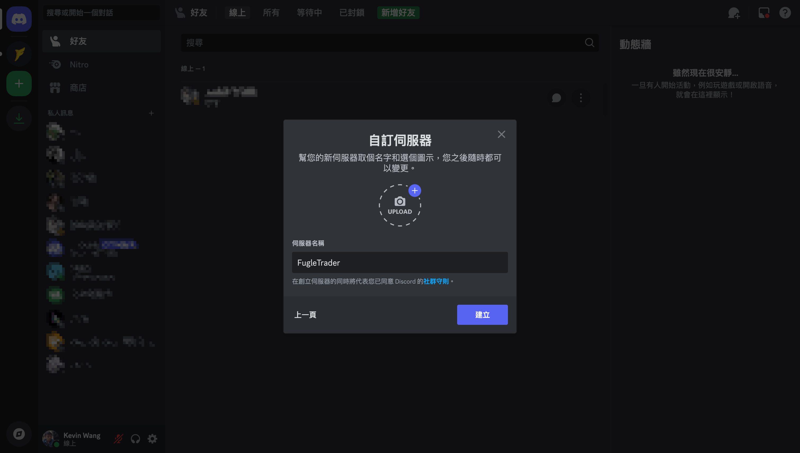

## 建立 Discord 開發者應用程式

1. 進入 Discord Developer Portal，登入你的 Discord 帳戶，建立新的開發者應用程式。
  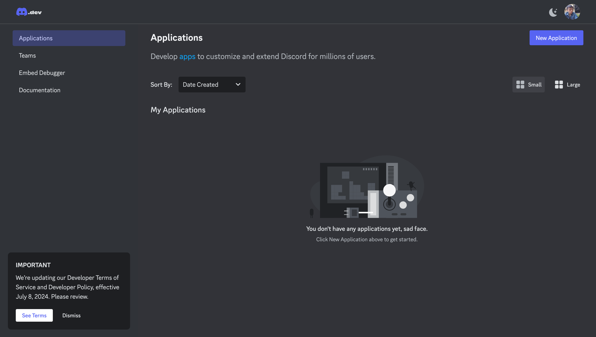

2. 輸入應用程式名稱，勾選同意條款，然後點擊「Create」按鈕。
  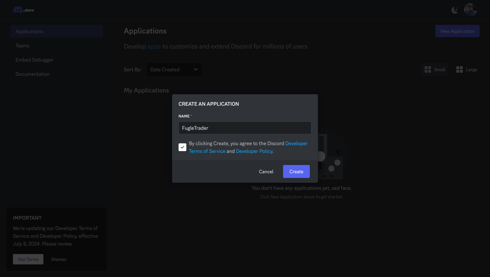

3. 應用程式建立完成後，於左側選單選擇「Bot」，開啟並設置相關權限。
  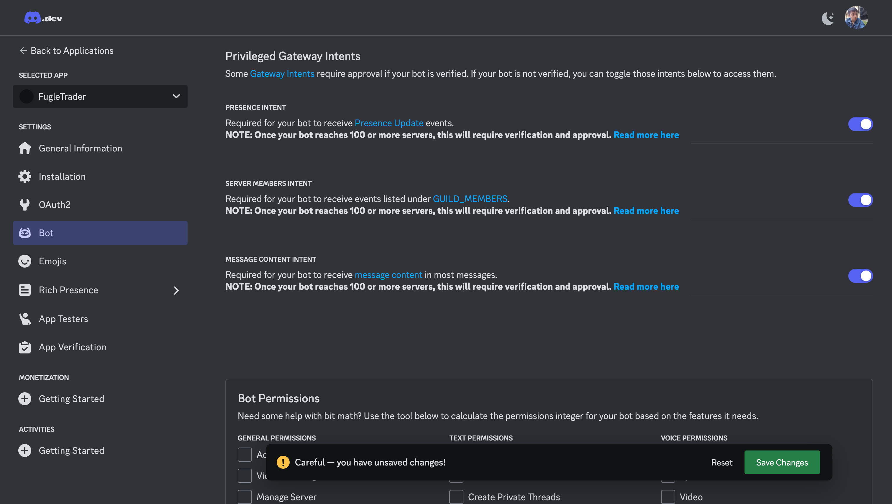

4. 點擊「Reset Token」按鈕，產生新的 Token。
  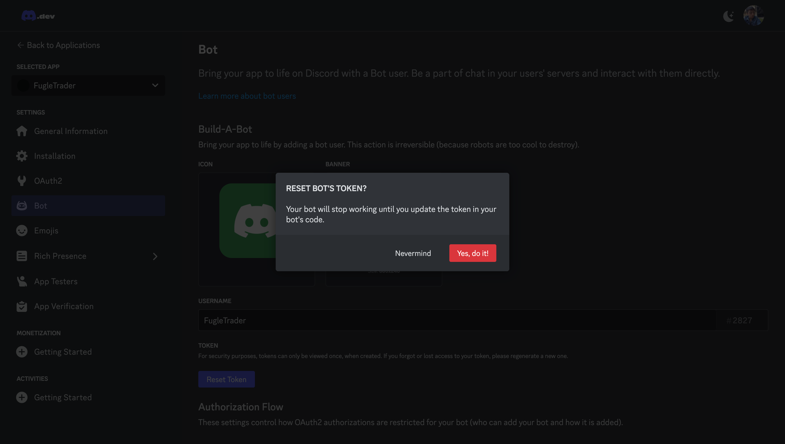

5. Token 會顯示在下方，請妥善記錄，後續設置中將會使用。
  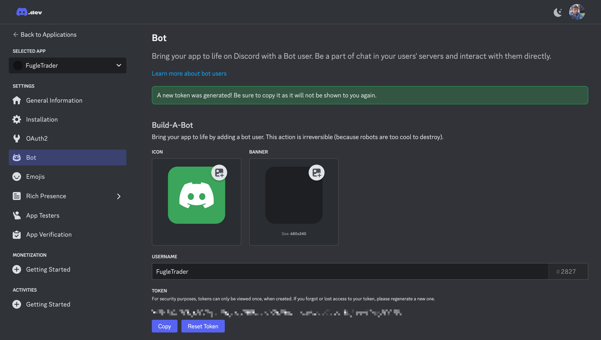

## 將 Discord Bot 加入伺服器

1. 在應用程式的左側選單中，選擇「OAuth 2」，於 Scope 表單中勾選「bot」。
  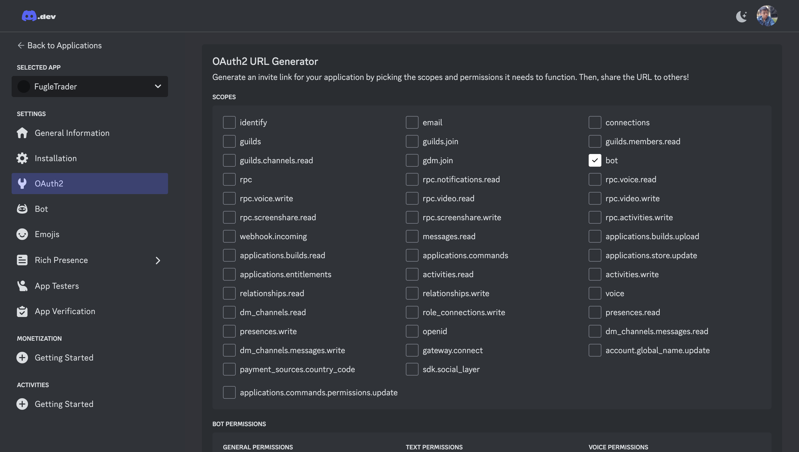

2. 在 Bot Permissions 表單中選擇「Administrator」以開啟所有權限。
  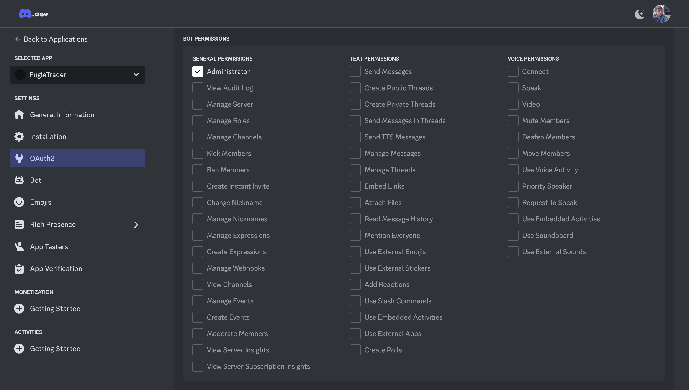

3. 複製「Generated URL」網址，並在瀏覽器開啟。
  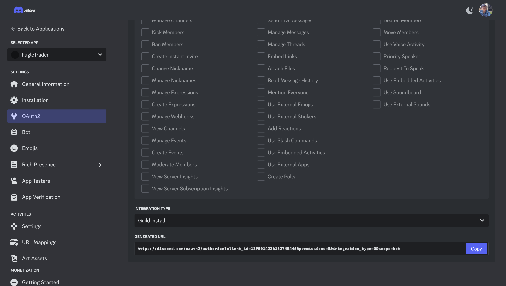

4. 授權機器人加入您的伺服器。
  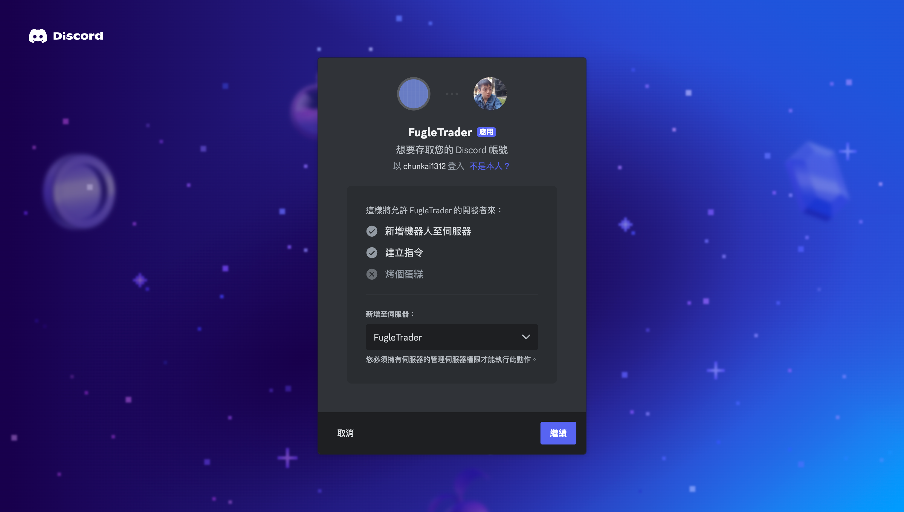

5. 確認授權權限，然後點擊「授權」。
  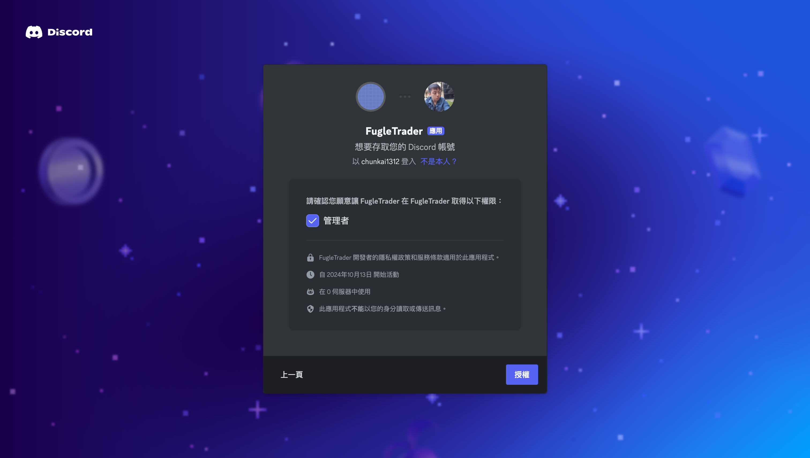

6. 授權完成後，關閉分頁。
  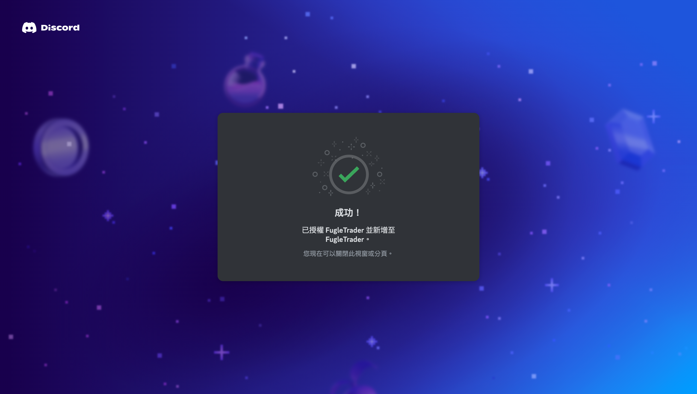

7. 回到伺服器，您會看到剛剛加入的 Bot 已經出現在成員列表中。
  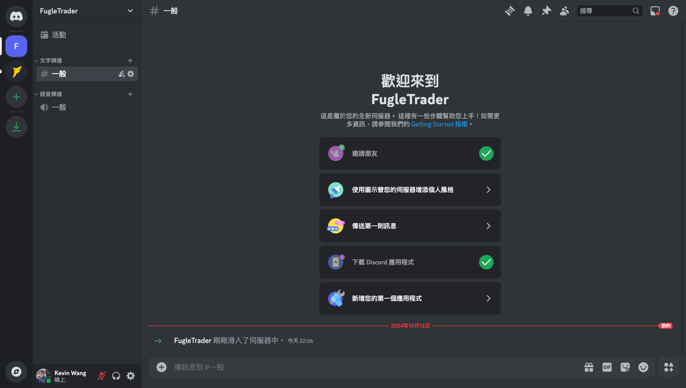

## 取得您的使用者 ID

1. 點擊 Discord 左下角的「使用者設定」圖示。
  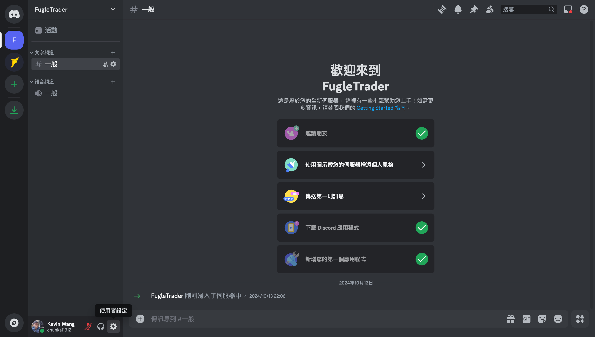

2. 選擇左側選單的「進階」，並啟用開發者模式。
  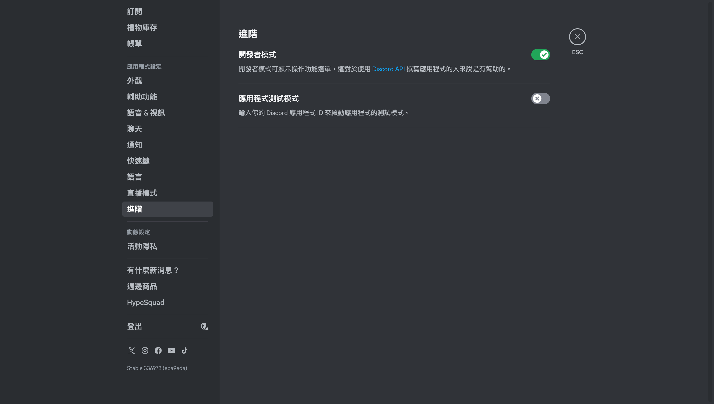

3. 回到 Discord 主頁，右鍵點擊您的使用者名稱，選擇「複製 ID」以取得您的使用者 ID。
  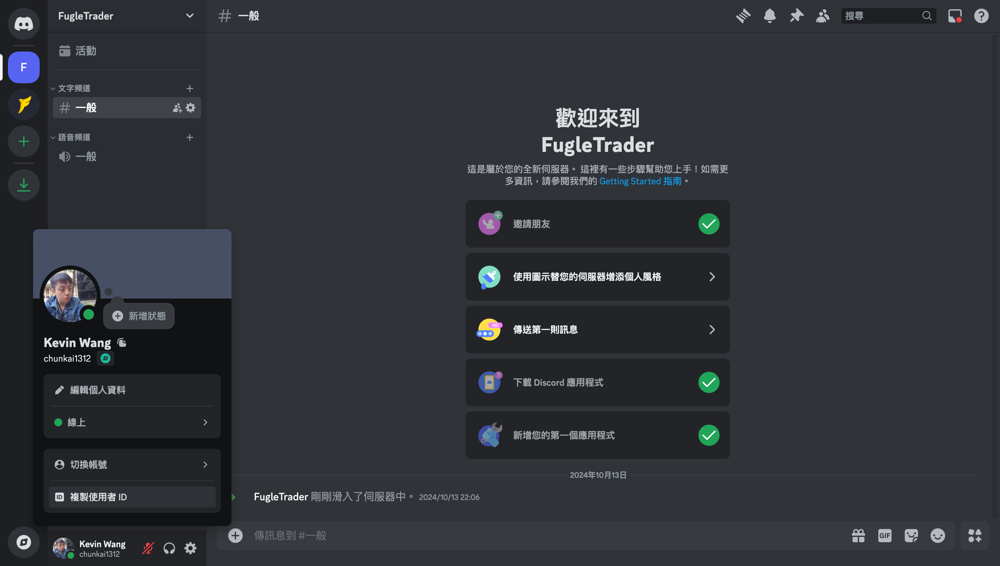
