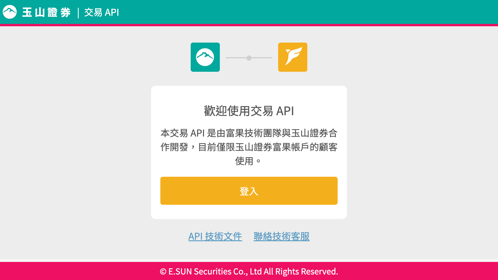

# 申請 Fugle API

[富果交易 API](https://fugletradingapi.esunsec.com.tw/keys/Home/Index) 是由富果技術團隊與玉山證券合作開發的程式交易 API。你可以在 Windows、Mac 和 Linux 平台上利用富果提供的 SDK，在台灣股票市場進行程式交易。只要你完成開立玉山證券富果帳戶，並簽署「**API 服務申請同意書**」，就可以透過線上申請取得交易權限。

## 使用富果交易 API 

在進行正式交易前，你需要先完成富果交易 API 文件中的 [事前準備](https://developer.fugle.tw/docs/trading/prerequisites)，包含 **申請使用交易 API 服務**，並且進行 **模擬測試**，以確保程式運作正常。完成這些步驟後，即可獲得正式環境交易權限，開始體驗程式交易所帶來的便捷與效率。

