# 設定 LINE Bot (可選)

LINE Bot 是一種自動化的聊天機器人，能透過 LINE 平台與使用者進行互動。FugleTrader 支援透過 LINE Bot 推送主動回報通知訊息。若要啟用 LINE Bot 的主動回報通知功能，您需要先申請 [LINE Messaging API](https://developers.line.biz/en/services/messaging-api/)。

:::info 資訊

LINE Messaging API 是由 LINE 提供的應用程式介面，讓開發者能與 LINE 用戶互動。透過此 API，開發者可以建立聊天機器人（Chatbot），自動在 LINE 平台上傳送與接收訊息，進行從單向通知到雙向溝通等多種操作。每月可免費發送一定數量的訊息，免費額度取決於您的 [LINE 官方帳號訂閱方案](https://developers.line.biz/en/docs/messaging-api/overview/#line-official-account-plan)。

:::

## 申請 LINE Messaging API

1. 前往 [LINE Developers](https://developers.line.biz/) 平台，使用您的 LINE 帳號登入。如尚未擁有 LINE 帳號，請先註冊，並以該帳號登入 LINE Developers 平台。
  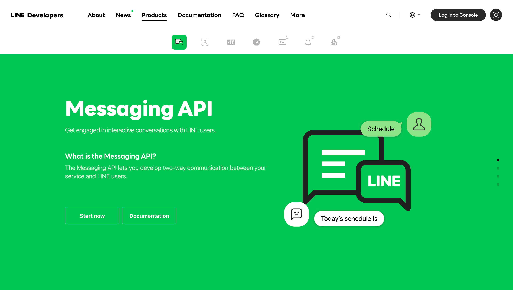

2. 登入後，點擊右上角的「Console」進入管理介面，從左側選單中選擇「Providers」，點擊「Create」，並輸入提供者名稱來建立新的 Provider。
  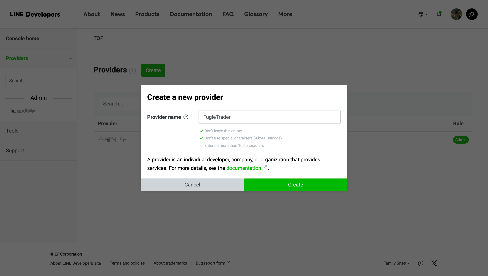

3. 完成 Provider 建立後，選擇「Create a Messaging API Channel」來建立 Messaging API Channel。
  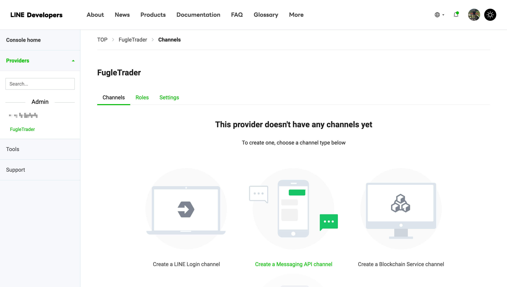

4. 如果您尚未擁有 LINE 官方帳號，請前往 LINE Official Account Manager 申請官方帳號，並將此帳號連接至 Messaging API Channel。
  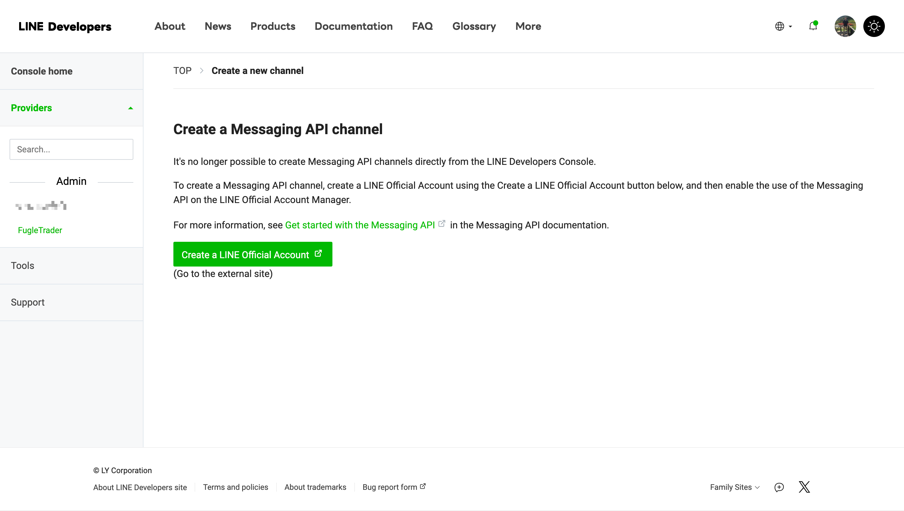

5. 按指示填寫 LINE 官方帳號的相關資訊。
  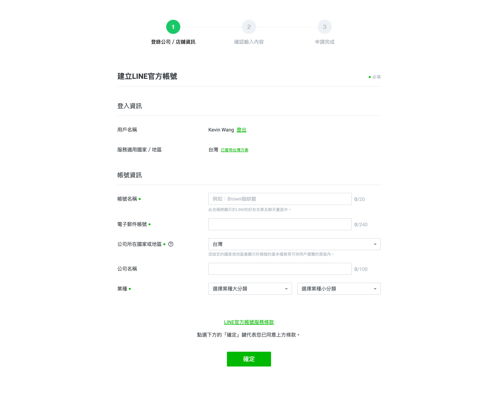

6. 確認輸入的所有資訊無誤後繼續。
  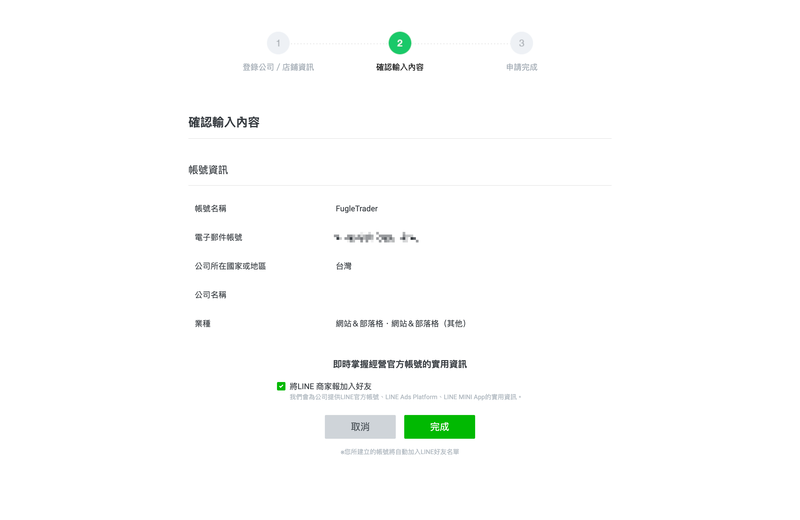

7. 申請完成後，點擊「前往 LINE Official Account Manager」進行後續設定。
  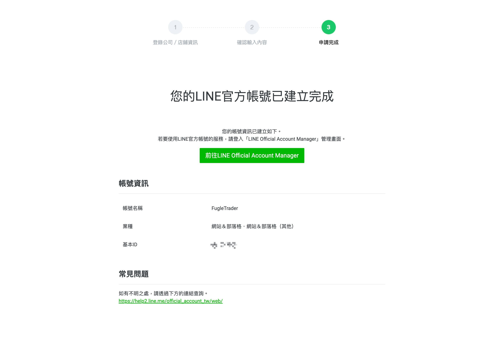

8. 進入 LINE Official Account Manager 時，您需同意 LINE 資料使用條款。請詳閱條款內容後點擊「同意」。
  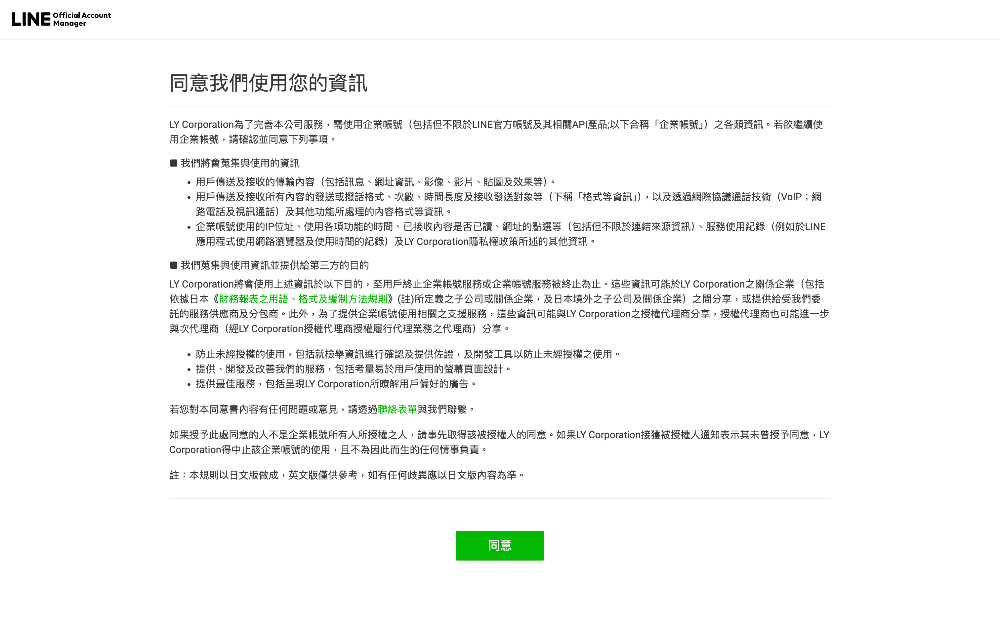

9. 進入 LINE Official Account Manager 後，點擊右上角的「設定」，從左側選單中選擇「Messaging API」後，點選「啟用 Messaging API」。
  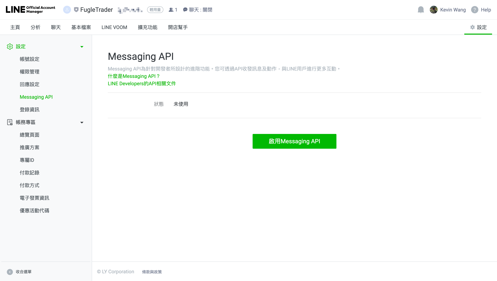

10. 在啟用 Messaging API 時，選擇您先前在 LINE Developers 建立的 Provider。
  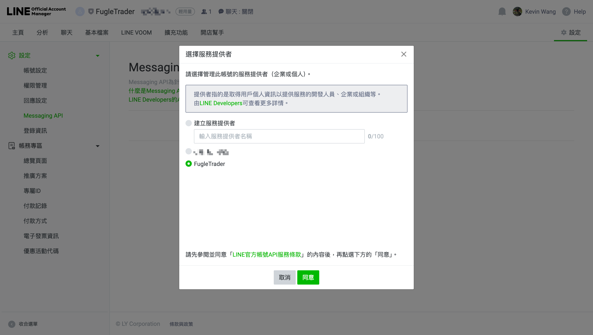

11. 確認帳號名稱與對應的提供者名稱正確後，點擊「確定」。
  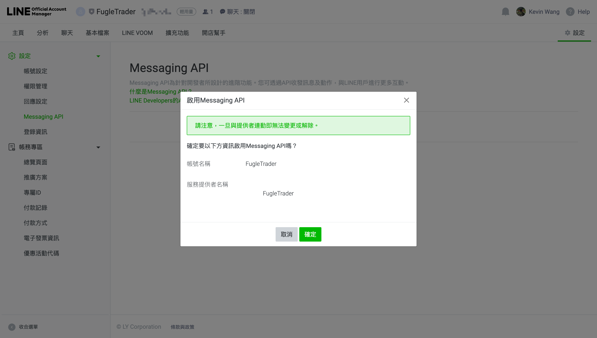

12. 返回 LINE Developers Console，進入您剛建立的 Provider 設定頁面。
  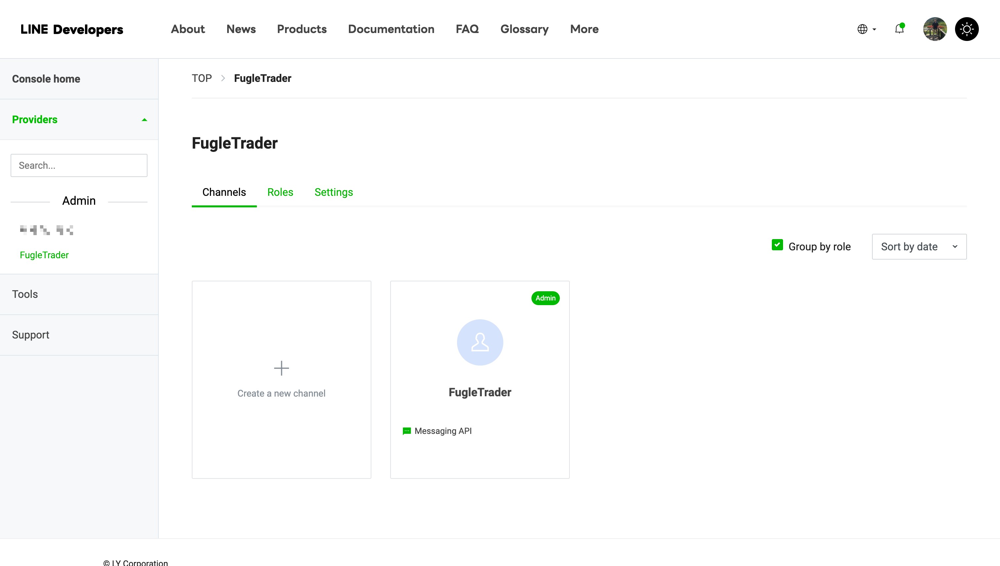

13. 在「Basic settings」頁籤下找到「Your user ID」，請記下此 ID，它將用於將訊息發送至您自己。
  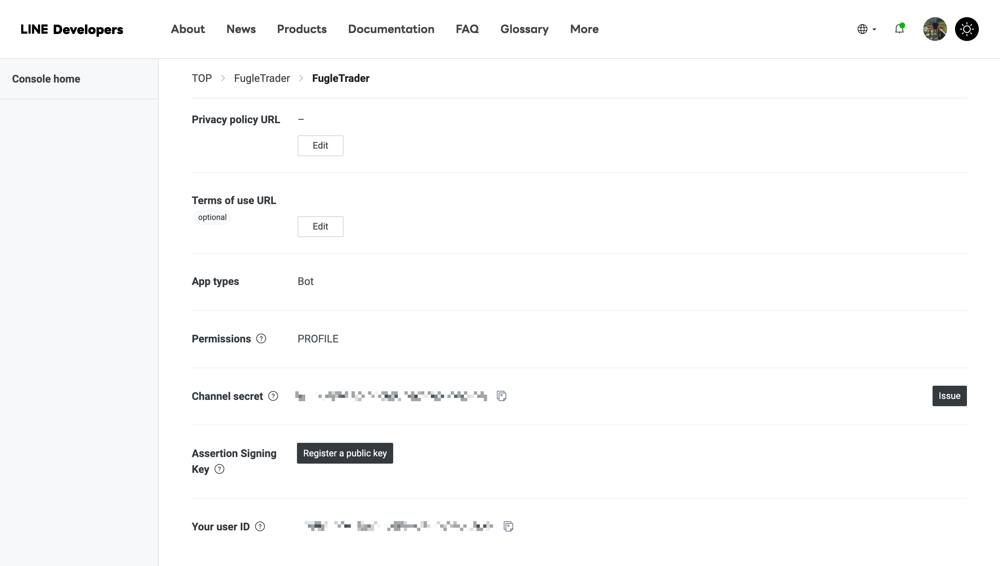

14. 在「Messaging API」頁籤中，點擊「Issue」來生成一個長期有效的 Channel Access Token，此 Token 用於 API 請求的驗證。
  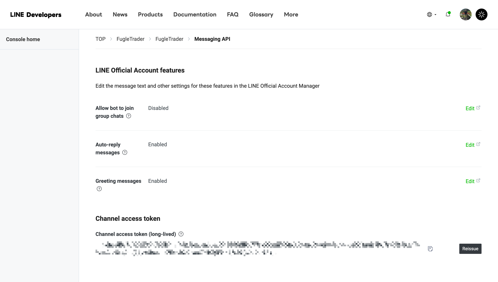
