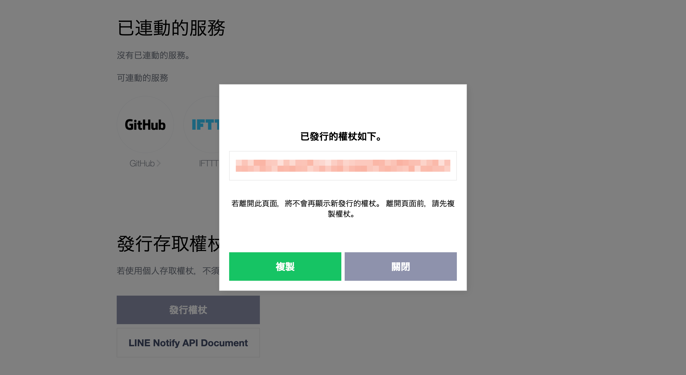

# 設定 LINE Notify (可選)

[LINE Notify](https://notify-bot.line.me/) 是由 [LINE](https://line.me/) 官方提供的服務，允許使用者透過 LINE 應用程式接收即時通知和訊息。FugleTrader 整合了 LINE Notify 服務，讓您可以即時獲取下單的委託回報和成交回報，提升交易的便利性與即時性。

:::danger 注意

根據 LINE Notify 的 [結束服務公告](https://notify-bot.line.me/closing-announce)，LINE Notify 將於 2025 年 4 月停止運作。為確保系統通知功能能夠持續運行，LINE 官方建議開發者改用 LINE Messaging API 取代 LINE Notify。

:::

## 取得 LINE Notify 存取權杖

您需要申請 LINE Notify 存取權杖以啟用 LINE Notify 服務。請確認你已經註冊並認證了你的 LINE 帳號。如果沒有，請先在你的行動裝置下載 LINE App 來完成註冊和認證。

1. 前往 [LINE Notify](https://notify-bot.line.me) 網站，登入你的 LINE 帳號後，點選「**個人頁面**」。
  

2. 跳轉頁面後，選擇「**發行權杖**」。
  

3. 接著會跳出一個表單視窗。請填寫權杖名稱，然後接收通知的聊天室請選擇「**透過1對1聊天接收Line Notify的通知**」，然後點選「**發行**」。
  

4. LINE Notify 將產生你的個人存取權杖。因為這段代碼只會出現一次，請務必記住這組權杖代碼。
  

5. 完成後，在「**連動的服務**」清單裡，就會出現我們剛剛所設定的服務。
  
