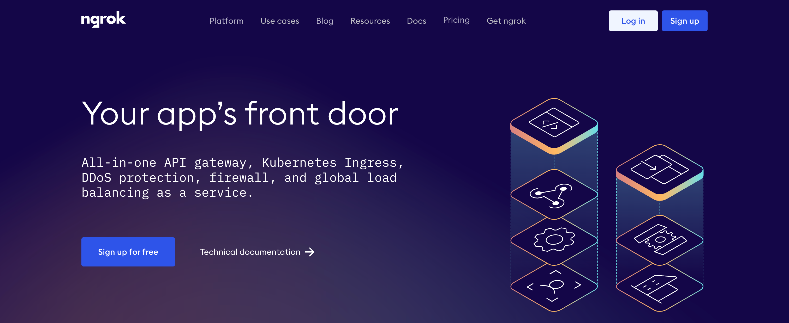
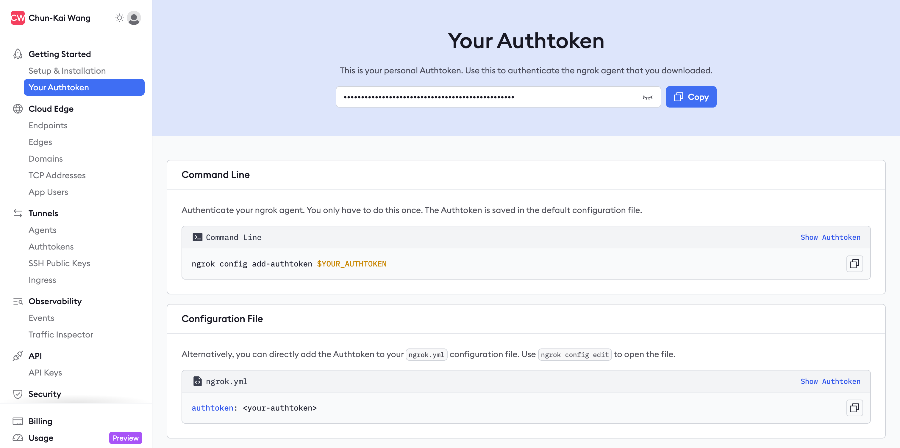

# 啟用 ngrok (可選)

[ngrok](https://ngrok.com/) 是一款能將本地應用程式暴露於網際網路上的工具，並透過建立安全通道，讓外部用戶能夠透過 ngrok 提供的公共網址訪問您本地運行的服務。

在特定情境下，ngrok 方便用於測試和開發，特別是在處理 webhook 等場景時。然而，對於生產環境，建議使用專業的伺服器和網路架構，以確保服務的穩定性和安全性。

## 取得 ngrok Authtoken

要啟用 ngrok 服務，您需要申請 ngrok 帳戶並獲取 Authtoken。

1. 前往 [ngrok](https://ngrok.com) 網站，點擊右上角的「**Sign Up**」按鈕，填寫所需資訊以建立帳戶。完成註冊後，使用您的帳戶登入 ngrok。

2. 登入後，您將進入控制面板（Dashboard）。在控制面板的「**Getting Started**」區塊下找到「**Your Authtoken**」，這裡將顯示您的 Authtoken。

