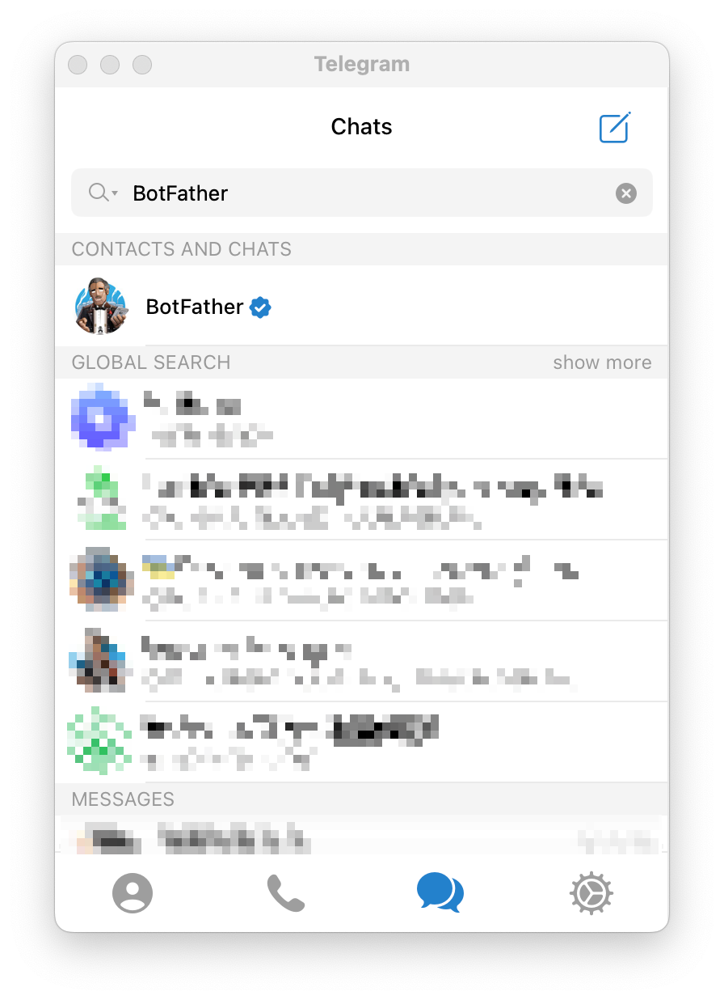
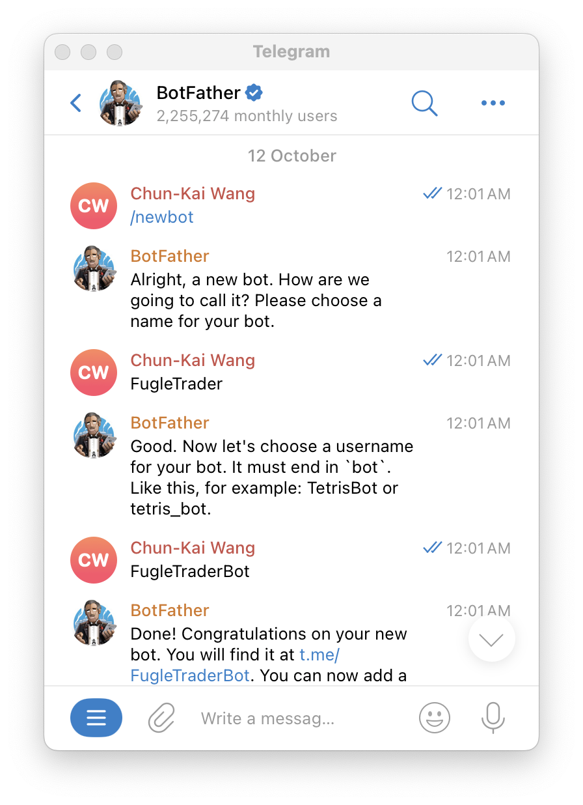
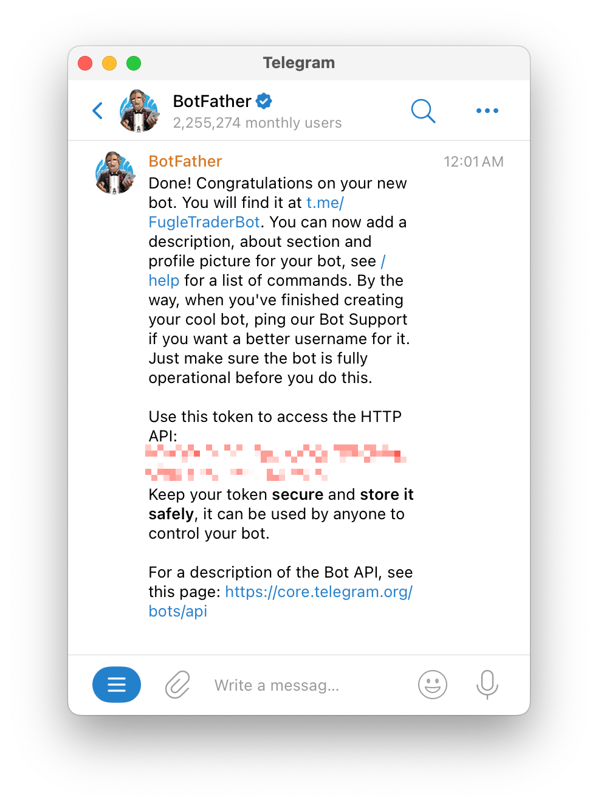
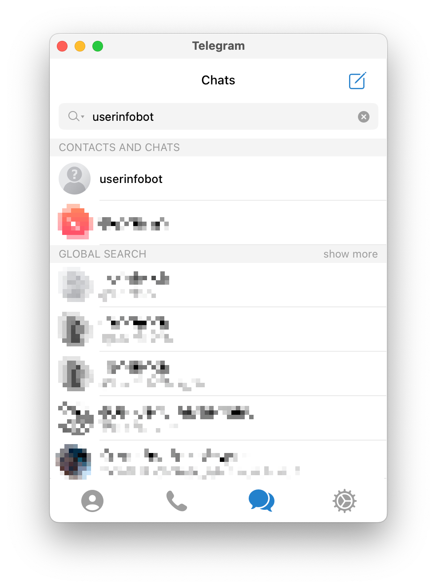
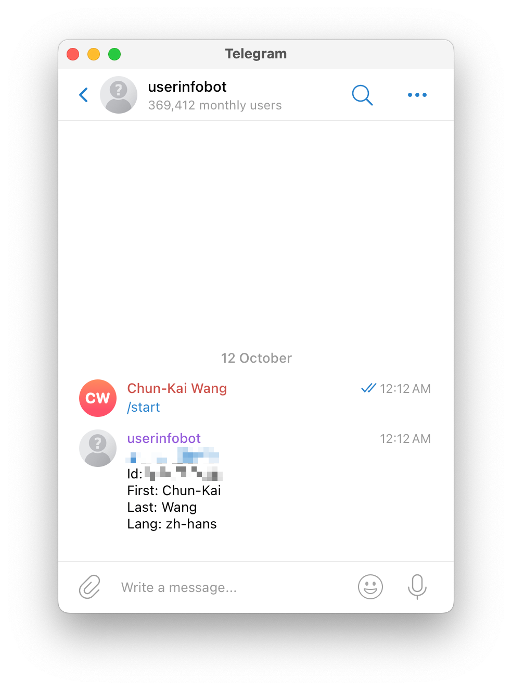

# 設定 Telegram Bot (可選)

Telegram Bot 是一種自動化的聊天機器人，能透過 Telegram 平台與使用者進行互動。FugleTrader 支援透過 Telegram Bot 推送主動回報通知訊息，若要啟用 Telegram Bot 的主動回報通知功能，您需要先申請 Telegram 帳號並建立 Telegram Bot。

## 建立 Telegram Bot

1. 打開 Telegram，搜尋「BotFather」並開始對話。
  

2. 輸入 `/newbot`，依照指示設定你的 Bot 名稱和使用者名稱。
  

3. 完成後，BotFather 會提供一個 token，這是你與 Telegram API 溝通的密鑰。
  

4. 在 Telegram 中搜尋「userinfobot」，並開始對話。
  

5. 輸入 `/start`，Bot 會回應你一條訊息，內容包含你的使用者資訊，其中就有你的 user id。
  
